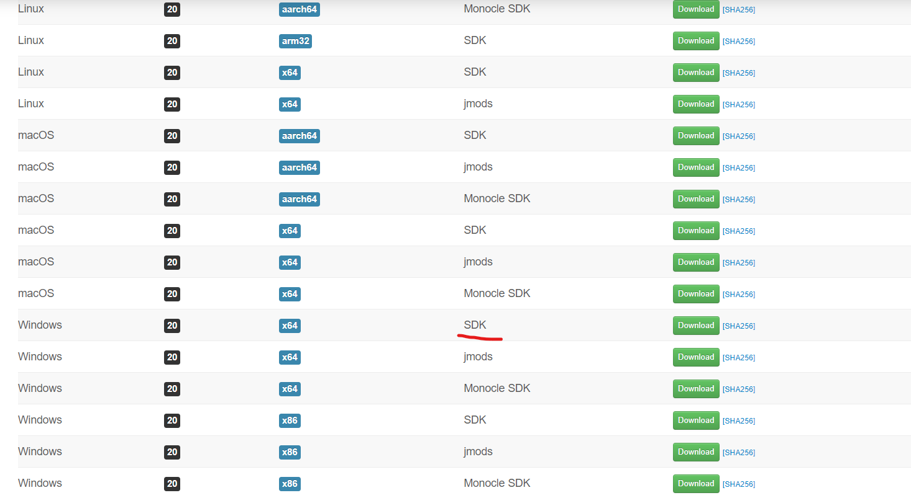
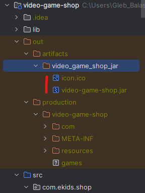
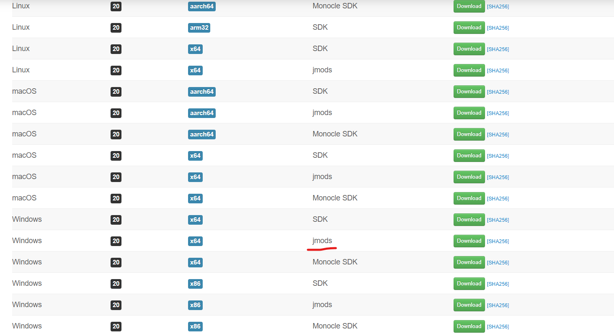
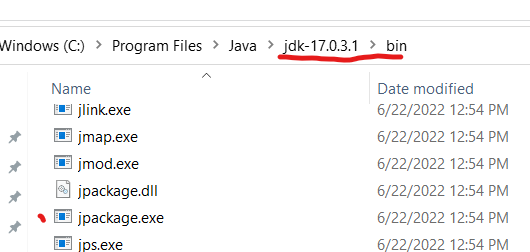

# video-game-shop

### a learning project for students ages 12-15 

#### How to add JavaFX to project:
1. Download JavaFX sdk 

2. Extract Archive to known place
3. File -> Project structure -> Libraries -> + -> Java -> path to extracted sdk to folder "lib": 

#### How to create executable application:
1. Build a jar file from source code:
   - File -> Project Structure -> Artifacts -> + -> jar -> from modules and dependencies
   - Build -> Build Artifacts... -> Build
2. Copy icon.ico from **resources/view/icons** folder to output directory which contains a jar - **out/artifacts/video_game_shop_jar** \

3. To make it easier to work, make sure that java jdk 17 is added to the system **Path**, you can check it with the command **java -version** (guide how to add java to path: https://www.java.com/en/download/help/path.html)
4. Download **jmods** and extract archive to known directory: https://gluonhq.com/products/javafx/ \

5. execute following command:
```bash
   jpackage -t exe --name "Video Game Shop" --description "Managing Video Games catalog for online shop" --app-version 1.0 --input "C:\Users\Gleb_Balashevich\IdeaProjects\video-game-shop\out\artifacts\video_game_shop_jar" --dest "C:\Users\Gleb_Balashevich\Desktop" --main-jar "video-game-shop.jar" --module-path "C:\Program Files\Java\javafx-jmods-20" --add-modules javafx.controls,javafx.fxml --win-shortcut --icon "icon.ico"
```

jpackage it's a jdk tool which could be found here: 


Command parameters' description: \
_name_ - application name \
_description_ - application description \
_app-version_ - application version \
_input_ - path to directory where stored jar file \
_dest_ - output directory in which the installer will be placed \
_main-jar_ - name of jar file \
_module-path_ - path to directory where stored downloaded jmods lib \
_add-modules_ - javafx modules should be added separately b'cos from java 9 it were removed from jdk \
_win-shortcut_ - flag which indicates that desktop shortcut will be added after installation \
_icon_ - name of icon file (it looks for it in the directory where jar stored)

